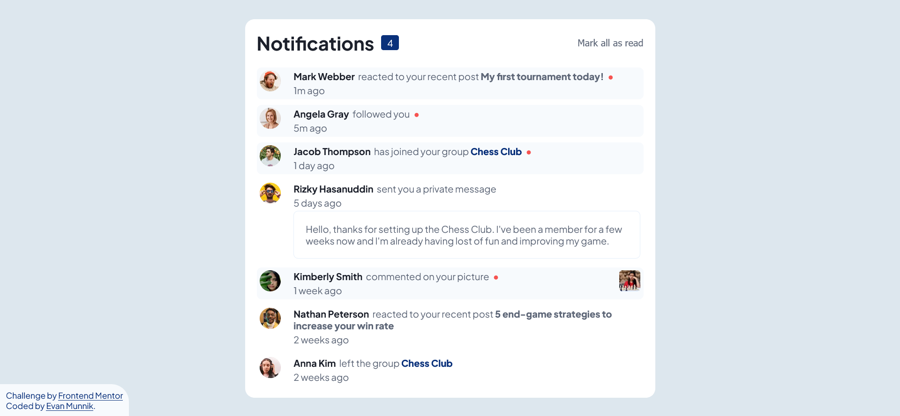

# Frontend Mentor - Notifications page solution

This is a solution to the [Notifications page challenge on Frontend Mentor](https://www.frontendmentor.io/challenges/notifications-page-DqK5QAmKbC). Frontend Mentor challenges help you improve your coding skills by building realistic projects. 

## Table of contents

- [Overview](#overview)
  - [The challenge](#the-challenge)
  - [Screenshot](#screenshot)
  - [Links](#links)
- [My process](#my-process)
  - [Built with](#built-with)
  - [What I learned](#what-i-learned)
  - [Useful resources](#useful-resources)
- [Author](#author)

## Overview

### The challenge

Users should be able to:

- Distinguish between "unread" and "read" notifications
- Select "Mark all as read" to toggle the visual state of the unread notifications and set the number of unread messages to zero
- View the optimal layout for the interface depending on their device's screen size
- See hover and focus states for all interactive elements on the page

### Screenshot



### Links

- Solution URL: [GitHub repository](https://github.com/EJMK18/FEM-notification_page)
- Live Site URL: [FEM: Notification Page](https://ejmk18.github.io/FEM-notification_page/)

## My process

### Built with

- Semantic HTML5 markup
- CSS custom properties
- Flexbox
- CSS Grid
- JavaScript

### What I learned

I had a challenge with creating the "circle" on the right-hand side of the notification text. The solution I came up with was using an HTML entity inside a span tag. Thus, ensuring the circle will appear on the right-hand side of the notification text irrespective of the number of characters.

I learnt abit more about the position property as I attempted to find solutions regarding the placement of the "circle" indicating a new notification.

```html
<span class="circle">&#9679;</span>
```

### Useful resources

- [HTML entities](https://www.compart.com/en/unicode/html) - This helped me to resolve the circle new notification indicator issue.
- [MDN - position property](https://developer.mozilla.org/en-US/docs/Web/CSS/position) - The documentation provides a comprehensive description of the position property and values.

## Author

- Frontend Mentor - [@EJMK18](https://www.frontendmentor.io/profile/EJMK18)
- Twitter - [@EJMK18](https://twitter.com/EJMK18)
